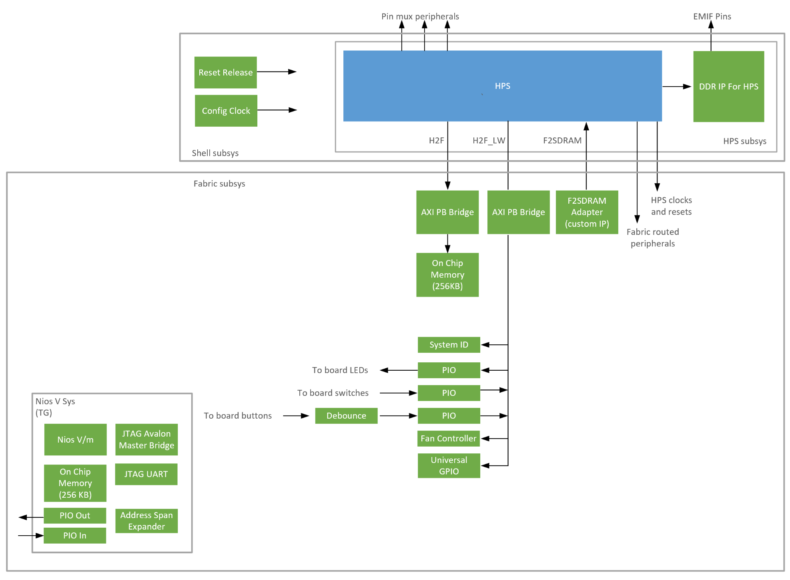
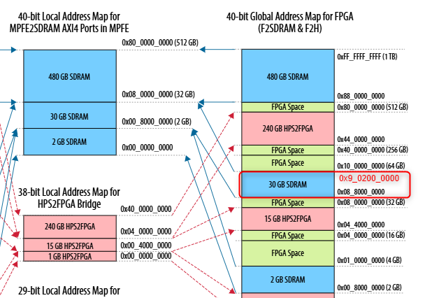
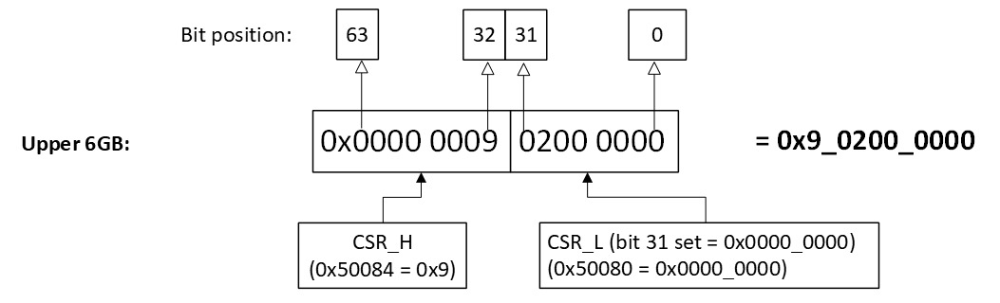
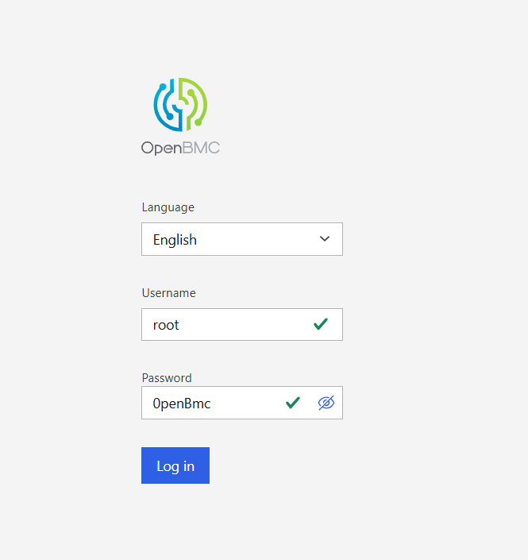
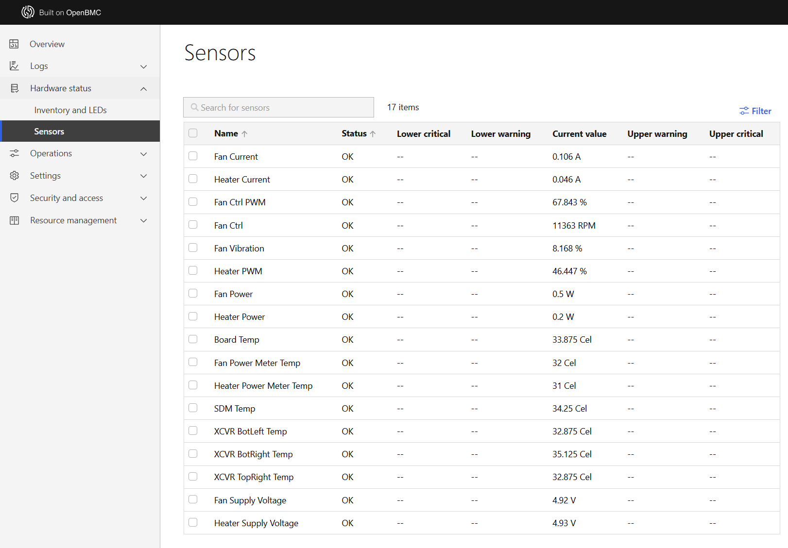
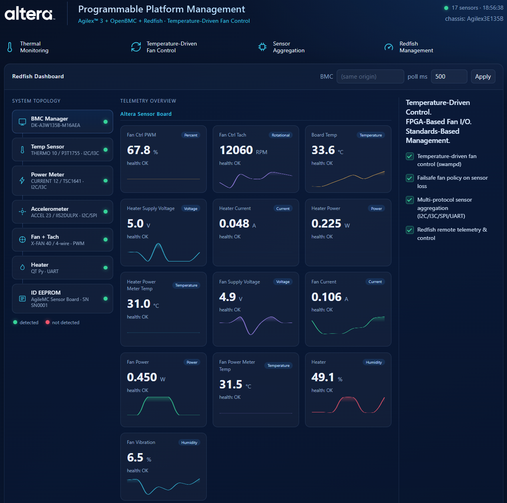
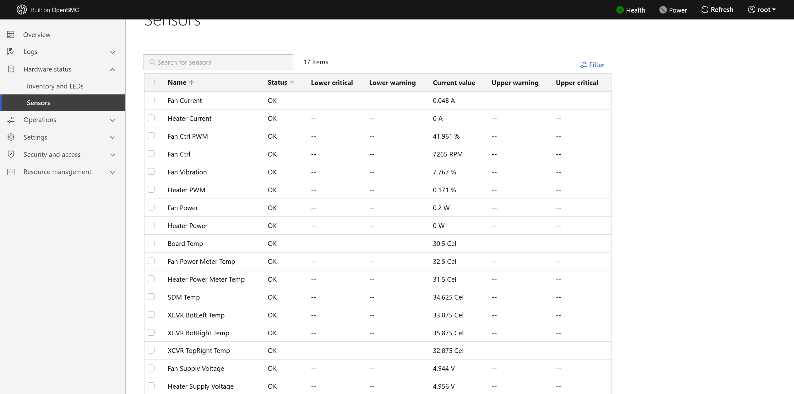

# HPS OmniMC System Example Design for Agilex 3 FPGA and SoC C-Series Development Kit

HPS OmniMC System Example Design for Agilex 3 FPGA and SoC C-Series Development Kit.

## Description

<p>This design is OpenBMC System Example Design for Altera Agilex 3 System On Chip (SoC) FPGA.

</p><p>This project provides the necessary files and collaterals to build a complete solution, including exercising soft IP in the fabric, booting to U-Boot, then Linux, and running sample Linux applications.
Refer to the <a href=\"https://altera-fpga.github.io/latest/embedded-designs/agilex-3/c-series/gsrd/ug-gsrd-agx3">HPS Baseline System Example Design User Guide for the Agilex 3 C-Series Development Kit</a> for more information.

</p><p>The design uses HPS First configuration mode.

</p><h2>Features and Specifications
</h2><p>This design demonstrates the following system integration between Hard Processor System (HPS) and FPGA IPs:
<ul><li>Hard Processor System (HPS) enablement and configuration
<ul><li>Enable dual core Arm Cortex-A55 processor
</li><li>HPS Peripheral and I/O (SD/MMC, EMAC, MDIO, USB, I2C, I3C, JTAG, UART, and GPIO)
</li><li>HPS Clock and Reset
</li><li>HPS FPGA Bridge and Interrupt
<ul><li>Note: The System MMU port in F2SDRAM bridge is disabled by default</li></ul>
</li></ul><li>HPS EMIF configuration (Inline ECC for LPDDR4 is enabled by default)
</li><li>System integration with FPGA IPs
<ul><li>Fabric subsystem that consists of System ID, Programmable I/O (PIO) IP for controlling PushButton and LEDs, 14-bit bidirectional GPIO (universal_gpio), and I3C/I2C bus-mode select.
</li><li>NiosV subsystem that consists of JTAG Avalon Master Bridge IP and Address Span Extender IP to allow System-Console debug activity and FPGA content access through JTAG.
</li></ul></li></ul></p>

## Hardware Requirements

- Agilex 3 FPGA and SoC C-Series Development Kit
- Altera Sensor Board

## Project Details

- **Family**: Agilex 3
- **Quartus Version**: 26.1.1
- **Development Kit**: Agilex 3 FPGA and SoC C-Series Development Kit DK-A3W135BM16AEA
- **Device Part**: A3CW135BM16AE6S
- **Category**: HPS
- **Source**: Quartus Prime Pro
- **URL**: https://github.com/altera-fpga/agilex3c-ed-gsrd
- **Design Package**: dk-a3w135bm16aea-baseline.zip

## Documentations

- **Title**: OpenBMC System Example Design User Guide for the Agilex 3 C-Series Development Kit
**URL**: https://github.com/altera-fpga/agilex5-ed-platform-management 

## Design overview
**Note for USB3.1**:
Agilex 3 Hard Processor System supports USB3.1.
However, Agilex 3 FPGA and SoC C-Series Development Kit does not have transceiver (XCVR) for USB3.1.
Therefore, the board only supports USB 2.0 ULPI interface via USB 3.1 controller.


## Hard Processor System (HPS)
This design's HPS configuration matches the board schematic.
Refer to [Hard Processor System Technical Reference Manual: Agilex 3 SoCs](https://docs.altera.com/r/docs/848530/current) and [Hard Processor System Component Reference Manual: Agilex 3 SoCs](https://docs.altera.com/r/docs/851703/current) for more information on HPS configuration.

## HPS External Memory Interfaces (EMIF)
The design HPS EMIF configuration matches the board schematic.
Refer to [External Memory Interfaces (EMIF) IP User Guide: Agilex 3 FPGAs and SoCs](https://docs.altera.com/r/docs/847458/current) for more information on HPS EMIF configuration.

## Bridges
Bridges are used to move data between FPGA fabric and HPS logic.
Refer to [HPS Bridges](https://docs.altera.com/r/docs/851703/26.1/hard-processor-system-component-reference-manual-agilextm-3-socs/fpga-bridges)

The HPS address map and the FPGA address map are the same for Agilex 3.
Refer to [Total Address Map Graphical](https://docs.altera.com/r/docs/848530/26.1/hard-processor-system-technical-reference-manual-agilex-3-socs/total-address-map-graphical) for more information.

Therefore, when accessing HPS logic in uboot or linux, the base address would be the same as, when using [Debug Subsystem](#Debug-Subsystem) from FPGA fabric.

| Bridge   | Use Case |
| :-- | :-- |
| F2SDRAM  | move data from FPGA fabric to HPS logic (non-coherent). Can access HPS EMIF. |
| LWH2F    | move data from HPS logic to FPGA fabric. Access FPGA peripherial Control Status Register (CSR). |
| H2F      | move data from HPS logic to FPGA fabric. Access FPGA Onchip Memory as scratch pad.    |

## Fabric Subsystem

### NiosV Subsystem
The JTAG UART IP interface allows access to the peripherals in the FPGA with System Console, through the JTAG UART IP module. This access does not rely on HPS software drivers.

Refer to this [Guide](https://docs.altera.com/r/docs/683819/current/quartus-prime-pro-edition-user-guide-debug-tools/introduction-to-system-console) for information about system console.

| NiosV                                | Attribute                    | Addresss Offset                           | Size (bytes)     |
|:-------------------------------------|------------------------------|-------------------------------------------|:----------------:|
| ocm                                  |  On-Chip Memory II           | 0x0                                       | 262144           |
| jtag_uart                            |  JTAG UART                   | 0x0005_0040                               | 8                |
| f2sdram_address_<br>span_extender    | Address Span Extender        | 0x0005_0080 (cntl)<br>0x8000_0000 (slave) | 8<br>1073741824  |
| pio_in                               | PIO (Parallel I/O) Inputs    | 0x0005_0050                               | 16               |
| pio_out                              | PIO (Parallel I/O) Outputs   | 0x0005_0060                               | 16               |


### SDRAM Access via Address Span Extender (F2SDRAM Bridge)

#### Overview

The PDK is equipped with **8 GB of SDRAM**, mapped across two physical address regions:

| Region       | Global Address Range                 | Local Address Range                     |
|--------------|--------------------------------------|-------------------------------------------|
| Lower 2 GB   | `0x00_8000_0000` – `0x00_FFFF_FFFF`  | `0x0_0000_0000` – `0x0_7FFF_FFFF`        |
| Upper 6 GB   | `0x08_8000_0000` – `0x09_FFFF_FFFF`   | `0x0_8000_0000` – `0x1_FFFF_FFFF`        |

> **

> **Note:** System Console/Nios V operates in a **32-bit address space** and cannot directly access 64-bit SDRAM addresses. The address `0x9_0200_0000` is an example of a target address in the upper 6GB region.

---

#### Address Span Extender IP

The **Address Span Extender IP (F2SDRAM Bridge)** resolves this limitation by using two control registers — **CSR_L** and **CSR_H** — to construct a full 64-bit physical SDRAM address from a 32-bit data address.

| Register | Base Address          | Holds                                   |
|----------|-----------------------|-----------------------------------------|
| `CSR_L`  | `0x50080`(F2SDRAM)    | Bits `[31:0]` of 64-bit target address  |
| `CSR_H`  | `0x50084`(F2SDRAM)    | Bits `[63:32]` of 64-bit target address |

Together, **CSR_H** and **CSR_L** define the physical SDRAM region that the 32-bit data address window points to.

#### How the Address Span Extender Works — The "Sliding Window" Concept

Think of the Address Span Extender like a **sliding window** cut into a wall:

- The **wall** represents the full 8 GB SDRAM — too large to see all at once.
- The **window** is a fixed **1 GB opening** (`0x0` to `0x4000_0000` in internal offset) that you can look through at any one time.
- The **CSR registers** are the handle you use to **slide the window** to point at any part of the 8 GB SDRAM.

In this design, the 1 GB window (windowed_slave) is placed at address from `0x8000_0000` to `0xbfff_ffff` (F2SDRAM) in the address_span_extender IP, covering exactly 2²⁸ × 4 = **1 GB** of addressable space through a 28-bit word address.

#### Sliding the Window — When to Shift CSR_L

For F2SDRAM as example, `CSR_L` is set to `0x8000_0000`, which anchors the window at `0x8000_0000` and allows System Console to read addresses from `0x8000_0000` to `0xBFFF_FFFF`. If your target SDRAM address exceeds this 1 GB window (i.e. the lower 32 bits of your target address is greater than `0xBFFF_FFFF`), you need to **slide the window** by updating `CSR_L` to the next 1 GB aligned boundary. Set `CSR_L` to `0xC000_0000`, which remaps the same fixed windowed_slave range (`0x8000_0000`–`0xBFFF_FFFF`) onto SDRAM `0xC000_0000`–`0xFFFF_FFFF`. The System Console master address is still always `0x8000_0000` + offset within that window (for example, target `0xC200_0000` → master `0x8200_0000`).

---

#### How to Perform a Read via System Console

**Step 1 — Set the CSR registers** before reading:
- Write the **lower 32 bits** of the target SDRAM address to `CSR_L` at `0x50080` (F2SDRAM).
- Write the **upper 32 bits** of the target SDRAM address to `CSR_H` at `0x50084` (F2SDRAM).

**Step 2 — Compute the data address:**

Compute_address = F2SDRAM Address Span Extender IP window slave address (0x8000_0000) + offset from target address

**Step 3 — Read from the computed data address** in System Console.

---

#### Example Target Address

> **
> *Figure 1: F2SDRAM Lower 2GB Example*

| Target Address | CSR_H | CSR_L       | F2SDRAM address span extender window slave address + offset |
|----------------|-------|-------------|-------------------------------------------------------------|
| 0xC200_0000    | 0x0   | 0xC000_0000 | 0x8000_0000 (f2sdram) + 0x0200_0000 = 0x8200_0000           |

> **
> *Figure 2: F2SDRAM Upper 6GB Example*

| Target Address | CSR_H | CSR_L       | F2SDRAM address span extender window slave address + offset |
|----------------|-------|-------------|-------------------------------------------------------------|
| 0x9_0200_0000  | 0x9   | 0x0000_0000 | 0x8000_0000 (f2sdram) + 0x0200_0000 = 0x8200_0000           |

---

#### Key Takeaway

> The **System Console input address (master_address)** is always derived from the **base address of the Address Span Extender IP window** plus the **offset extracted from the lower 32 bits of the target address**, regardless of which SDRAM region you are accessing.

> In summary: **`CSR_H` selects the SDRAM bank, `CSR_L` slides the window within that bank, and the master_address is always base_address + offset from the target address.**

## Peripheral
| Peripheral | Address Offset | Size (bytes) | Attribute | Interrupt Number
| :-- | :-- | :-- | :-- | :-- |
| fan_control | 0x0000_0000 | 1024 | ADI AXI fan PWM/tach | 18 |
| sysid | 0x0001_0000 | 8 | Unique system ID   | None |
| led_pio | 0x0001_0080 | 16 | LED outputs   | None |
| button_pio | 0x0001_0060 | 16 | Push button inputs | 17 |
| bus_mode | 0x0001_0090 | 16 | I3C0 / EMAC0-I2C pad select | None |
| universal_gpio | 0x0001_00A0 | 16 | 14-bit Pi-header GPIO | 19 |

### Notes
- There are 1 user push-button inputs and 2 LED outputs that is connected to fpga pins on Agilex 3 FPGA and SoC C-Series Development Kit.
  -  Only the lower bit of LED outputs are available for software to control. The most significant bit of the LED is used in the design top module as heartbeat led. This LED blinks when the fpga design is loaded. Users will not be able to control this LED with HPS software, for example U-Boot or Linux.
- The peripheral is accessed via the LWH2F bridge and has an offset of 0x0_2000_0000. Refer to [Total Address Map Graphicals](https://docs.altera.com/r/docs/848530/26.1/hard-processor-system-technical-reference-manual-agilex-3-socs/total-address-map-graphical) for more information.
- The FPGA IRQ has offset of 17 when mapped to Generic Interrupt Controller (GIC) in device tree structure(dts). Refer to [GIC Shared Peripheral Interrupts Map for the SoC HPS](https://docs.altera.com/r/docs/848530/26.1/hard-processor-system-technical-reference-manual-agilextm-3-socs/gic-shared-peripheral-interrupts-map-for-the-soc-hps)

### I2C / I3C configuration
HPS I3C0 and HPS EMAC0 I2C share the sensor-board SDA/SCL pads (`i3c_sda` AJ24, `i3c_scl` AJ23, `i3c_pu` AH21).
The fabric `bus_mode` PIO at LWH2F offset 0x0001_0090 (HPS address 0x2001_0090) selects the owner.
HPS I2C1 on `id_sd` / `id_sc` is a separate bus for the HAT EEPROM and is not used for this mux.

| bus_mode value | Owner |
| :-- | :-- |
| 0 | HPS I3C0 (default, reset) |
| 1 | HPS EMAC0 I2C |

Enable only one controller in the linux device tree — never leave both `&i3c0` and the EMAC0 I2C node `okay` at the same time.

**I3C mode (default)**
The shipped dts enables `&i3c0`. `bus_mode` resets to 0, so no MMIO write is required after power-up.
```bash
devmem 0x20010090 32 0
ls /sys/bus/i3c/devices/
```

**I2C mode**
Disable `&i3c0`, enable the EMAC0 I2C controller (`&i2c@10c02a00`), and set `bus_mode` to 1. See [Using HPS I2C Master for Custom I2C Sensors](#using-hps-i2c-master-for-custom-i2c-sensors) below for the complete procedure — DTS edits, PIO enable, device detection, driver bind, and sensor reads.

### Universal GPIO (14-bit)
`universal_gpio` is a 14-bit bidirectional PIO at LWH2F offset 0x0001_00A0 (HPS address 0x2001_00A0), interrupt number 19 when mapped to GIC SPI.
Each line defaults to input (hi-Z). Pi-header GPIO10 (PWM, AG21) and GPIO12 (tach, AF23) are connected to fan_control, not this bank.

For AJ27 (`ugpio[11]` / Pi-header GPIO13 / RPI_GPIO26), set **TMUX_SEL to 1** on the development kit so the analog mux routes RPI_GPIO26 to AJ27. TMUX_SEL = 0 routes the PLL reference clock to AJ27 instead.

| Fabric bit | Pi-header GPIO | Ball |
| :-- | :-- | :-- |
| ugpio[0] | GPIO0 | AG20 |
| ugpio[1] | GPIO1 | AG19 |
| ugpio[2] | GPIO2 | AK22 |
| ugpio[3] | GPIO3 | AJ25 |
| ugpio[4] | GPIO4 | AH25 |
| ugpio[5] | GPIO5 | AE25 |
| ugpio[6] | GPIO6 | AH22 |
| ugpio[7] | GPIO7 | AJ19 |
| ugpio[8] | GPIO8 | AH23 |
| ugpio[9] | GPIO9 | AH18 |
| ugpio[10] | GPIO11 | AF22 |
| ugpio[11] | GPIO13 / RPI_GPIO26 | AJ27 (TMUX_SEL = 1) |
| ugpio[12] | GPIO14 | AK24 |
| ugpio[13] | GPIO15 | AH26 |

| PIO offset | Register | Use |
| :-- | :-- | :-- |
| 0x0 | data | Read pin / write output value |
| 0x4 | direction | 1 = output, 0 = input (reset = all input) |
| 0x8 | irqmask | Enable interrupt per bit |
| 0xC | edgecapture | Falling-edge capture / W1C |

**Quick debug via direct register access (`devmem`):**

```bash
devmem 0x200100A4 32 0x1   # set ugpio[0] as output
devmem 0x200100A0 32 0x1   # drive ugpio[0] high
devmem 0x200100A0 32       # read all 14 lines (bit mask)
```

> This directly pokes the PIO registers and is useful for quick debugging. For application code, use the Linux GPIO driver interface below.

---

### Using the Linux GPIO Driver (`gpio_altera`)

The `altr,pio-1.0` device tree node binds to the `gpio_altera` kernel driver, which exposes the 14 lines through the standard Linux GPIO character device interface. This is the **recommended approach** for application code. Use the `libgpiod` tools (`gpiodetect`, `gpioinfo`, `gpioget`, `gpioset`) available in the OpenBMC image.

#### Find the GPIO chip

```bash
gpiodetect
# gpiochip0 [/soc@0/gpio@200100a0] (32 lines)  ← universal_gpio (this one)
# gpiochip1 [10c03200.gpio] (24 lines)
# gpiochip2 [10c03300.gpio] (24 lines)
```

> **Note:** `gpio_altera` exposes the full 32-bit PIO register width. Only lines 0–13 are physically connected in the FPGA fabric; lines 14–31 are unused hi-Z pins.

The chip name (`gpiochip0`, etc.) may vary between boots — identify it by the `200100a0` address in the label:

```bash
CHIP=$(gpiodetect | awk '/200100a0/{print $1}')
echo "universal_gpio chip: $CHIP"
```

#### Check current direction and value of all lines

```bash
gpioinfo $CHIP
# gpiochip0 - 32 lines:
#   line   0:      unnamed       unused   input  active-high
#   line   1:      unnamed       unused   input  active-high
#   ...
#   line  31:      unnamed       unused   input  active-high
```

The third column is the current direction (`input` / `output`). All lines default to `input` (hi-Z) at reset.

To check a single line's direction:
```bash
# Direction of line 0 only
gpioinfo $CHIP | awk '/^\s*line\s+0:/{print "line 0 direction:", $5}'
```

Via the **direction register** (all 32 bits at once, bit N=1 means output):
```bash
devmem 0x200100A4 32
# 0x00000000 = all input (reset state)
# 0x00000001 = line 0 is output, rest input
```

#### Read a pin value (input)

Make sure the line is in input direction first. Since the `altr,pio-1.0` direction register persists across process exits, run `gpioget` once to reset the direction to input before applying an external signal:

```bash
gpioget $CHIP 0   # also resets direction to input as a side effect
```

Then drive the pin externally and read back:

```bash
# Pin connected to GND
gpioget $CHIP 0
# 0

# Pin connected to 3.3V
gpioget $CHIP 0
# 1
```

#### Set a pin as output and drive it high / low

> ⚠️ Disconnect any external signal from the pin before switching to output — driving against the SoC output can damage the buffer.

```bash
# Drive ugpio[0] high → measure ~3.3 V on Pi-header pin 11 (ball AG20)
gpioset $CHIP 0=1

# Drive ugpio[0] low → measure ~0 V
gpioset $CHIP 0=0

# Drive multiple lines at once
gpioset $CHIP 0=1 1=0 2=1
```

> **Note:** `gpioset` exits immediately, but the `altr,pio-1.0` direction and value registers persist in hardware — the pin stays driven after the command returns. To hold the line and block until Ctrl-C, use `gpioset --mode=signal $CHIP 0=1`.

To switch a line back to input after driving it as output, use `gpioget`:

```bash
gpioget $CHIP 0   # opens line as input → direction register resets to input
```

#### Monitor for interrupts (falling edge)

The `altr,pio-1.0` IP in this design is compiled for **falling-edge interrupts only** (`altr,interrupt-type = <IRQ_TYPE_EDGE_FALLING>` in the DTS). Use `gpiomon --falling-edge`:

```bash
gpiomon --falling-edge $CHIP 0
```

Drive the pin to 3.3V first, then pull it to GND — you will see an event printed each time the edge is detected:

```
event: FALLING EDGE offset: 0 timestamp: [    2995.458810594]
```

> **Note:** Multiple events at nearly the same timestamp (contact bounce) are normal when toggling with a jumper wire. A clean signal source (sensor output, button with debounce) will produce a single event per transition.

`gpiomon` (both edges) and `--rising-edge` will return an error because the FPGA IP only captures falling edges. To support rising or both edges, the Quartus PIO IP interrupt type setting and the DTS `altr,interrupt-type` must be updated and the FPGA rebuilt.

#### Line offset to Pi-header GPIO mapping (quick reference)

| Line offset | Pi-header GPIO | Ball |
|:-----------:|:--------------:|:----:|
| 0  | GPIO0  | AG20 |
| 1  | GPIO1  | AG19 |
| 2  | GPIO2  | AK22 |
| 3  | GPIO3  | AJ25 |
| 4  | GPIO4  | AH25 |
| 5  | GPIO5  | AE25 |
| 6  | GPIO6  | AH22 |
| 7  | GPIO7  | AJ19 |
| 8  | GPIO8  | AH23 |
| 9  | GPIO9  | AH18 |
| 10 | GPIO11 | AF22 |
| 11 | GPIO13 / RPI_GPIO26 | AJ27 (TMUX_SEL = 1) |
| 12 | GPIO14 | AK24 |
| 13 | GPIO15 | AH26 |

## Hardware build
**Prerequisites**
- Altera Quartus Prime 26.1.1
- Python 3.11.5 (only required when using command line to build)

### Using Quartus GUI
1. Launch Quartus Prime 26.1.1
2. Open the design project. E.g top.qpf.
3. Click the play button to compile the design.
4. The compiled sof can be found in output_files folder of the project path.

### Using Command Line
1. Build the design sof
```bash
make baseline-build
```
After build, the bitstream (sof) can be found in output_files folder.

2. Use the following command to install the sof and core.rbf (optional)
```bash
make baseline-install-sof
```
The generated sof and core.rbf can be found in install/binaries folder.

# Yocto Build Setup Guide
1. Refer to [OpenBMC Build Instructions](software/openbmc/README.md) and follow the steps to build.

After build, binaries are under `software/openbmc/build/tmp/deploy/images/<machine>/`.
If built via the top-level Makefile install flow, they are also copied to `install/binaries/software/openbmc_linux_sd`.

# HPS Debug Program
Refer to the [README](software/hps_debug/README.md) file and follow the steps to build the HPS content wipe program.
---

## Hardware Demonstration

### Prerequisites

Before running the demo, ensure the following are in place:

- **Sensor board EEPROM provisioned** — the EEPROM on the sensor board must be programmed with the correct FRU data for the web UI inventory entry to appear:
  ```bash
  printf '\x01\x00\x01\x04\x0b\x00\x00\xef\x01\x03\x17\xc7\x41\x33\x57\x31\x33\x35\x42\xc6\x53\x4e\x30\x30\x30\x31\xc1\x00\x00\x00\x00\xa5\x01\x07\x00\x00\x00\x00\xc6\x41\x6c\x74\x65\x72\x61\xd4\x41\x67\x69\x6c\x65\x4d\x43\x20\x53\x65\x6e\x73\x6f\x72\x20\x42\x6f\x61\x72\x64\xc6\x53\x4e\x30\x30\x30\x31\xc7\x41\x33\x57\x31\x33\x35\x42\xc3\x46\x52\x55\xc1\x00\xfb\x01\x08\x00\xc6\x41\x6c\x74\x65\x72\x61\xd4\x41\x67\x69\x6c\x65\x4d\x43\x20\x53\x65\x6e\x73\x6f\x72\x20\x42\x6f\x61\x72\x64\xc7\x41\x33\x57\x31\x33\x35\x42\xc3\x31\x2e\x30\xc6\x53\x4e\x30\x30\x30\x31\xc0\xc3\x46\x52\x55\xc1\x00\x00\x00\x00\x00\x00\x00\xee' \
    > /sys/bus/i2c/devices/2-0050/eeprom && sync && echo "DONE"
  systemctl restart xyz.openbmc_project.FruDevice.service
  ```

- **QtPy RP2040 heater controller** connected via USB and programmed with `code.py` (provided in this demo).

---

### 1. Boot and Log In

Flash the SD card and boot the HPS. Log in via the serial console or SSH:

| Field    | Value      |
|----------|------------|
| Username | `root`     |
| Password | `0penBmc`  |

> **Note:** The password uses the digit **`0`** (zero), not the letter `O`.

---

### 2. Get the Board IP Address

```bash
ip addr show eth0
```

Example output:
```
2: eth0: <BROADCAST,MULTICAST,UP,LOWER_UP> mtu 1500 qdisc mq qlen 1000
    link/ether 02:00:00:a5:01:3b brd ff:ff:ff:ff:ff:ff
    inet 192.168.9.26/24 brd 192.168.9.255 scope global dynamic eth0
       valid_lft 3115024sec preferred_lft 3115024sec
```

Note the IP address (e.g. `192.168.9.26`).

---

### 3. Open the OpenBMC Web UI

On the host machine, open a web browser and navigate to `https://<ip-address>`.
Log in with the same credentials (`root` / `0penBmc`).

**

---

### 4. View Sensor Readings

Navigate to the **Sensors** tab to see live readings. The demo exposes 17 sensors including:

| Sensor | Description |
|--------|-------------|
| `Board Temp` | Temperature of the sensor board (°C) — drives the fan PID |
| `Fan Ctrl PWM` | Fan PWM duty cycle (%) set by the controller |
| `Fan Ctrl` | Actual fan speed (RPM) |
| `Heater PWM` | PWM duty cycle (%) applied to the heater by the QtPy |
| `Heater Power` / `Heater Current` | Power drawn by the heater element (W / A) |
| `Fan Power` / `Fan Current` | Power drawn by the fan (W / A) |
| `SDM Temp`, `XCVR *` | Additional on-chip temperature sensors |
| `Fan/Heater Supply Voltage` | Supply voltages (~4.9 V) |

**

In the screenshot above, `Board Temp` is **33.875°C** and `Fan Ctrl PWM` is **67.84%** — consistent with the 33°C → 68% step in the temperature mapping table below.

---

### 5. Custom Dashboard (Optional)

A custom dashboard aggregates the key sensors in a single view and is available at:

```
https://<ip-address>/dashboard
```

**

---

### 6. Temperature-to-Fan Mapping

Fan speed is automatically controlled by `phosphor-pid-control` using a stepwise algorithm.
The mapping is defined in `software/openbmc/meta-custom/recipes-phosphor/phosphor-pid-control/files/config.json`:

| Board Temp (°C) | Fan Output (%) |
|-----------------|----------------|
| ≤ 25            | 20             |
| 27              | 30             |
| 29              | 42             |
| 31              | 55             |
| 33              | 68             |
| 35              | 80             |
| 37              | 90             |
| ≥ 40            | 100            |

- **Minimum fan output:** 20% (idle — fan always running to prevent stall)
- **Failsafe:** 100% (if `Board_Temp` sensor becomes unavailable)
- **Hysteresis:** ±1 °C (temperature must cross a step boundary by at least 1°C before the fan speed changes, preventing rapid oscillation)
- **Sample period:** 1 second

---

### 7. Heater Control Demo

The QtPy RP2040 reads a potentiometer on pin `A0` and drives a resistive heater via PWM on pin `A2` at 20 kHz. Rotate the knob to raise or lower the board temperature and observe the fan speed change automatically in response.

**Low temperature** — knob turned down, heater off, fan at low speed:

- `Board Temp` ≈ **30.5°C** → `Fan Ctrl PWM` ≈ **42%** *(matches 29°C → 42% in the table)*

**

**High temperature** — knob turned up, heater on, fan at high speed:

- `Board Temp` ≈ **37.6°C** → `Fan Ctrl PWM` ≈ **90%** *(matches 37°C → 90% in the table)*

**

#### QtPy Firmware (`code.py`)

The QtPy runs [CircuitPython](https://circuitpython.org/) (tested with 8.2.9). Plug the QtPy into USB — it mounts as a `CIRCUITPY` drive — then copy the following `code.py` to the root of that drive and the board auto-reloads within a few seconds:

```bash
cp code.py /media/<user>/CIRCUITPY/code.py
sync
```

The firmware reads the potentiometer on `A0`, drives the heater PWM on `A2` at 20 kHz, and streams the raw value over the hardware UART (TX/RX) at 115200 baud:

```python
print("Starting!")

import time
import board
import busio
import pwmio
import analogio


knobIn = analogio.AnalogIn(board.A0)
pwmOut = pwmio.PWMOut(board.A2, frequency=20000, duty_cycle=0)

uart = busio.UART(board.TX, board.RX, baudrate=115200, timeout=0)

while True:
    burn = knobIn.value
    pwmOut.duty_cycle = burn
    uart.write(f"Heater: {burn}\n".encode("utf-8"))
    time.sleep(0.1)
```

> All modules used are built into CircuitPython, so the `lib/` directory can be left empty. The USB serial console (`/dev/ttyACM0`) only shows `print()` output; the heater value is streamed on the hardware TX pin (monitor with `screen /dev/ttyUSB0 115200`).

---

## Using HPS I2C Master for Custom I2C Sensors

By default, the sensor board uses the **HPS I3C0** controller (`baseline.dts` → `&i3c0`) to communicate with the P3T1755 and TSC1641 devices, which are native I3C parts.

The HPS also has dedicated I2C masters. Since I3C devices are backward-compatible with I2C, the same sensor board devices can alternatively be reached via the HPS I2C master. More importantly, this demonstrates the path for connecting **any standard I2C sensor** to the HPS.

This section documents the DTS changes and verification steps using the sensor board devices (P3T1755 @ 0x48, TSC1641 × 2 @ 0x42 / 0x43) as a concrete example.

---

### Step 1 — Modify `baseline.dts` and Rebuild

Two nodes must be changed together — you must **disable `&i3c0` and enable `&i2c@10c02a00`** at the same time. The physical SDA/SCL pads (`i3c_sda` AJ24, `i3c_scl` AJ23) are shared; leaving both `okay` simultaneously is not supported.

**Disable I3C0** (remove or comment out the child sensor nodes — they are I3C-specific and must not remain when the controller is disabled):

```dts
&i3c0 {
    status = "disabled";
    /* tsc1641 I3C child nodes removed — pads now owned by EMAC0 I2C */
};
```

**Enable HPS EMAC0 I2C master** (`i2c@10c02a00`) and register the sensor devices. Linux enumerates this controller as `i2c-2` on this board:

```dts
&i2c@10c02a00 {
    compatible = "snps,designware-i2c";
    reg = <0x10c02a00 0x100>;
    #address-cells = <0x01>;
    #size-cells = <0x00>;
    interrupts = <0x00 0x69 0x04>;
    resets = <0x09 0x4a>;
    clocks = <0x0a 0x2a>;
    status = "okay";

    /* NXP P3T1755 — temperature sensor */
    p3t1755@48 {
        compatible = "nxp,p3t1755";
        reg = <0x48>;
    };

    /* ST TSC1641 — fan rail power monitor (Rshunt = 0.1 Ω) */
    tsc1641@42 {
        compatible = "st,tsc1641";
        reg = <0x42>;
        shunt-resistor-micro-ohms = <100000>;
    };

    /* ST TSC1641 — heater rail power monitor (Rshunt = 0.1 Ω) */
    tsc1641@43 {
        compatible = "st,tsc1641";
        reg = <0x43>;
        shunt-resistor-micro-ohms = <100000>;
    };
};
```

> **Note:** If connecting your own I2C sensor, replace the device nodes above with your sensor's `compatible` string and I2C address. The controller and bus configuration remain the same.

After editing `baseline.dts`, rebuild the OpenBMC image, flash to SD card, and boot the board.

---

### Step 2 — Enable the Sensor Board via FPGA PIO (in Linux)

The `bus_mode` PIO at HPS address `0x20010090` (LWH2F offset `0x0001_0090`) does two things in one write:

1. **Switches the physical SDA/SCL pads** from I3C0 to EMAC0 I2C (value `0` = I3C, value `1` = I2C)
2. **Powers the sensor board** — I2C devices will not respond until this bit is set

> **Note:** Setting this in Linux (after boot) is the simplest approach. If you prefer to set it in U-Boot, do it **after** `fpga load` and `bridge enable` — the FPGA fabric must be up before the PIO register is accessible. When set from U-Boot, the pads are already in I2C mode when Linux probes the devices, so the drivers bind cleanly at boot and the manual unbind/rebind step (Step 4) is not needed.

```bash
# Switch pads to EMAC0 I2C and enable sensor board power
devmem 0x20010090 32 1

# Confirm
devmem 0x20010090 32
# Expected: 0x00000001
```

---

### Step 3 — Verify I2C Devices Are Detected

```bash
# List available I2C buses
i2cdetect -l
# i2c-0  →  10da1000.i3c  (I3C adapter)
# i2c-1  →  Synopsys DesignWare I2C adapter  (EEPROM bus)
# i2c-2  →  Synopsys DesignWare I2C adapter  ← sensor devices here

# Scan the sensor bus
i2cdetect -y -r 2
```

Expected output after PIO is set to 1:

```
     0  1  2  3  4  5  6  7  8  9  a  b  c  d  e  f
00:                         0c -- -- -- -- -- -- --
10: -- -- -- -- -- -- -- -- -- -- -- -- -- -- -- --
20: -- -- -- -- -- -- -- -- -- -- -- -- -- -- -- --
30: -- -- -- -- -- -- -- -- -- -- -- -- -- -- -- --
40: -- -- UU UU -- -- -- -- UU -- -- -- -- -- -- --
50: -- -- -- -- -- -- -- -- -- -- -- -- -- -- -- --
```

| Address | Device | Description |
|---------|--------|-------------|
| `0x42`  | TSC1641 | Fan rail power monitor |
| `0x43`  | TSC1641 | Heater rail power monitor |
| `0x48`  | P3T1755 | Board temperature sensor |

> **`UU` means the address is already claimed by a kernel driver** (Under Use) — this is the expected state after drivers bind. If you see bare hex addresses (`42`, `43`, `48`) instead of `UU`, the drivers have not yet bound; proceed to Step 4 to bind them manually.

---

### Step 4 — Bind Drivers Manually (if needed)

If `i2cdetect` showed `UU` at 0x42, 0x43, and 0x48 (Step 3), the drivers already bound at boot — **skip this step** and go straight to Step 5.

If you saw bare hex addresses instead of `UU`, the physical pads were still in I3C mode when the kernel first probed them (PIO=0 at boot), causing `error -EREMOTEIO`. Now that PIO=1, unbind the stale entry and rebind so the driver re-probes with the pads live:

```bash
# Unbind stale boot-time probe (if driver attempted probe at boot and failed)
echo 2-0042 > /sys/bus/i2c/drivers/tsc1641/unbind 2>/dev/null || true
echo 2-0043 > /sys/bus/i2c/drivers/tsc1641/unbind 2>/dev/null || true
echo 2-0048 > /sys/bus/i2c/drivers/lm75/unbind    2>/dev/null || true

# Rebind — driver re-probes now that pads are live
echo 2-0042 > /sys/bus/i2c/drivers/tsc1641/bind
echo 2-0043 > /sys/bus/i2c/drivers/tsc1641/bind
echo 2-0048 > /sys/bus/i2c/drivers/lm75/bind
```

> **Note:** The `p3t1755` driver is provided by the `lm75` kernel driver on this image (the P3T1755 is register-compatible with LM75). On successful bind you will see in `dmesg`:
> ```
> tsc1641 2-0042: power monitor tsc1641 (Rshunt = 100000 uOhm)
> tsc1641 2-0043: power monitor tsc1641 (Rshunt = 100000 uOhm)
> lm75 2-0048: hwmon4: sensor 'p3t1755'
> ```

Verify the hwmon devices appeared:

```bash
ls /sys/class/hwmon/
for h in /sys/class/hwmon/hwmon*; do echo "$h: $(cat $h/name)"; done
# hwmonX: tsc1641   (fan rail, @ 0x42)
# hwmonY: tsc1641   (heater rail, @ 0x43)
# hwmonZ: p3t1755   (board temperature)
```

> **Note:** The exact `hwmonN` indices depend on what other hwmon drivers are loaded. Use `cat $h/name` to identify each one rather than relying on a fixed index.

---

### Step 5 — Read Sensor Values

Use the `name` file to find the right hwmon index, then read the attributes:

```bash
# Find each sensor's hwmon directory by name
P3T=$(grep -rl "^p3t1755$" /sys/class/hwmon/*/name | head -1 | xargs dirname)
TSC1=$(grep -rl "^tsc1641$" /sys/class/hwmon/*/name | head -1 | xargs dirname)
TSC2=$(grep -rl "^tsc1641$" /sys/class/hwmon/*/name | tail -1 | xargs dirname)

# Board temperature (millidegrees Celsius)
cat $P3T/temp1_input
# Example: 34300  →  34.3°C

# TSC1641 — current (mA) and power (µW)
# Note: in1_input (voltage) is not populated by the tsc1641 driver on this board.
# Use curr1_input and power1_input instead.
cat $TSC1/temp1_input    # e.g. 32000  →  32°C (junction temp)
cat $TSC1/curr1_input    # e.g. 48     →  48 mA
cat $TSC1/power1_input   # e.g. 225000 →  225 mW

cat $TSC2/temp1_input    # e.g. 33000  →  33°C
cat $TSC2/curr1_input    # e.g. 79     →  79 mA
cat $TSC2/power1_input   # e.g. 375000 →  375 mW
```

